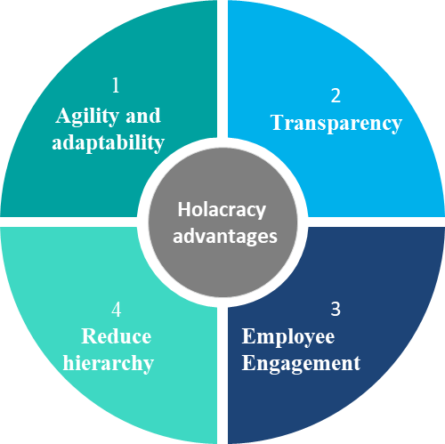
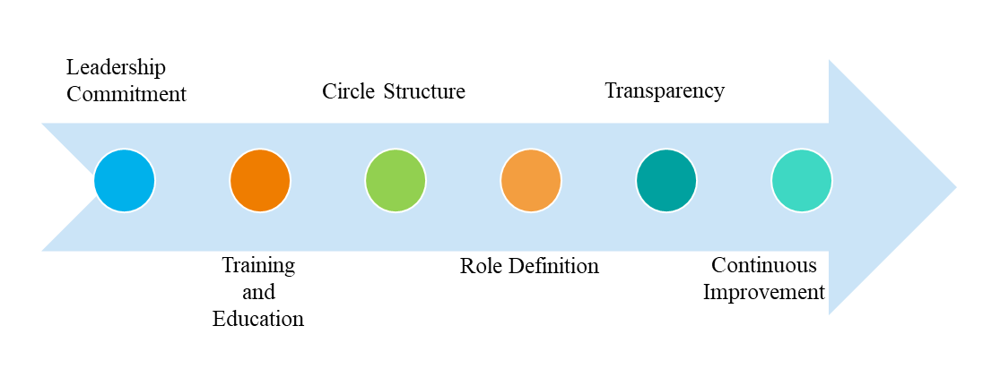

## The Future of Organizations - Holacracy?
---
## Quiz Time - What is Holacracy?

---
## What is Holacracy?
"Holacracy is a social technology for governing an organization and arranging its collective efforts."

(Brian J. Robertson, Author and Holacracy Developer)
---
## What is Holacracy?

"An organizational framework that aims to make companies more agile by distributing authorities and decision-making processes throughout an organization." 

(Oliver Maska)
---
## Structure of Holacracy

---
## Why we need Holacracy?

---
## How Holacracy can be implemented?

---
### Thank you!

