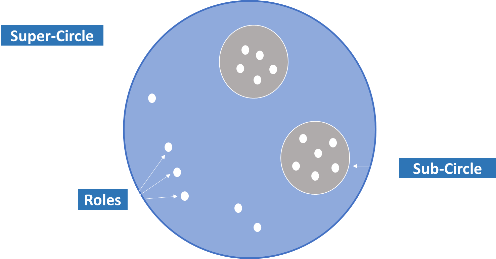

## The Future of Organizations - Holacracy

## Introduction
The way organizations are led and managed has changed significantly over the decades. One of the most innovative approaches that has attracted increasing attention in recent years is holacracy. This blog post will provide you with a comprehensive insight into the world of holacracy, from its fundamentals to its potential benefits and challenges.
 
 ## What is Holacracy
 Holacracy is an organizational model that emphasizes transparency, decentralization and self-management. Instead of a traditional hierarchical structure in which power and decision-making authority flow from the top down, holacracy is based on so-called "circles" or "cells". These circles are autonomous units responsible for specific tasks or functions within the organization

Its about working in circles:

 The basic principles of holacracy:

•	Roles: In holacracy, each person in the organization defines clear roles and responsibilities to perform. These roles are specific and changeable
 according to the needs of the organization.

•	Sub-Circles: The organization is divided into different circles, each responsible for specific functions. These circles can organize themselves independently and make decisions within the scope of their responsibilities.

•	Super-Circle: Combine to create a larger circle, known as a "super circle", until the entire organization is represented by one circle.

## Why do we need Holacracy?

1) Agility and adaptability: Holacracy enables organizations to adapt quickly to change and respond flexibly to new challenges

2) Transparency: Holacracy prioritizes transparency in decision-making and organizational processes, leading to better communication and understanding.

3) Reduce hierarchy:Traditional hierarchical organizations often have numerous management layers, leading to bureaucracy and slower decision-making processes. Holacracy, on the other hand, has fewer layers, resulting in a flatter, more efficient structure.

4) Employee Engagement: Holacracy allows individuals and teams to self-manage, promoting autonomy, personal responsibility, and engagement.

## How does Holacracy an be applied?

 
