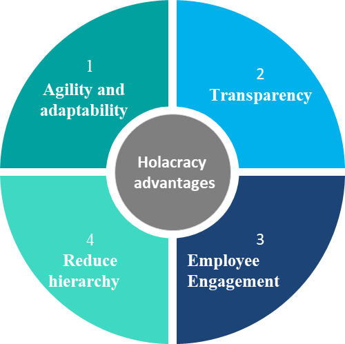

 ## The Future of Organizations - Holacracy
by Oliver Maska, 15/11/2023
## Introduction
The way organizations are led and managed has changed significantly over the decades. One of the most innovative approaches that has attracted increasing attention in recent years is holacracy. This blog post will provide you with a comprehensive insight into the world of holacracy, from its fundamentals to its potential benefits and how it can be implemented.
 
 ## What is Holacracy?
 
 "Holacracy is a social technology for governing an organization and arranging its collective efforts."

(Brian J. Robertson, Author and Holacracy Developer)
 
 Holacracy is an organizational model that emphasizes transparency, decentralization and self-management. Instead of a traditional hierarchical structure in which power and decision-making authority flow from the top down, holacracy is based on so-called "circles". These circles are autonomous units responsible for specific tasks or functions within the organization

Its about working in circles:

 The basic principles of holacracy:

Roles: 
- In holacracy, each person in the organization defines clear roles and responsibilities to perform. These roles are specific and changeable
 according to the needs of the organization.
 - Each role has autonomy in making decisions related to its defined responsibilities, contributing to the overall adaptability and agility of the organization

Sub-Circles:  
- It represents a more focused or specialized grouping of roles with a specific purpose or function and has its own set of roles and responsibilities but operates within the broader context of the Super Circle's purpose. 
- It contributes to the overall goals of the organization while maintaining a degree of autonomy

Super-Circle: 
- A Super Circle is a higher-level circle in the holacratic organizational structure. 
- It's a broader grouping that encompasses other circles within the organization.
- It is responsible for overseeing and coordinating the activities of its Sub Circles. 

## Why do we need Holacracy?

1) Agility and adaptability: 

- The distributed authority and decision-making structure allow for quicker responses to new information or shifts in the business environment..

2) Transparency: 

- Holacracy promotes transparency in decision-making processes. Roles, responsibilities, and decision-making authority are clearly defined, reducing ambiguity and fostering a more open organizational culture

3) Employee Engagement: 

- Holacracy empowers individuals by providing them with clear roles and responsibilities. This reduces the need for micromanagement and allows employees to take ownership of their work, fostering a sense of autonomy and accountability

4) Reduce hierarchy:

- Traditional hierarchical organizations often have numerous management layers, leading to bureaucracy and slower decision-making processes. Holacracy aims to eliminate unnecessary bureaucracy by removing layers of hierarchy. This can result in a leaner, more efficient organization with fewer administrative barriers to innovation and collaboration.

## How does Holacracy can be applied?

Implementing Holacracy requires a structured approach and a significant shift in the way an organization operates. Here are the key steps to implementing Holacracy:

Leadership Commitment: 

- Top leadership needs to be committed to the transition to Holacracy. This commitment should be communicated throughout the organization to gain buy-in from all employees.

Training and Education: 
- to all employees about Holacracy principles, roles, and processes. Everyone in the organization needs to understand the new system.

Circle Structure: 
- Define the organizational structure using circles. Circles represent different parts of the organization and have their own roles and accountability's.

Role Definition: 
- define roles, accountability's, and expectations for each position within the organization. This includes not only traditional job roles but also broader roles related to decision-making and governance.

Transparency: 
- making all relevant information, decisions, and policies accessible to everyone within the organization. Use digital tools or platforms to share this information.

Continuous Improvement: 
- Use feedback mechanisms to evaluate the effectiveness of the Holacracy system and make adjustments as needed.
